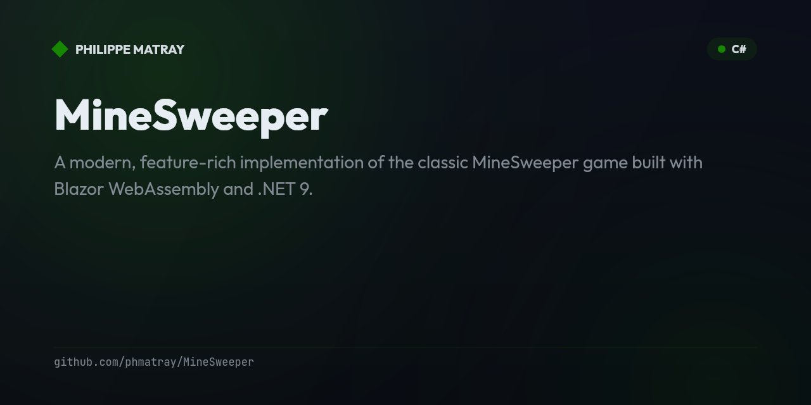

# MineSweeper 💣

<!-- portfolio-badges:start -->
<!-- Identity -->
[](https://github.com/phmatray/MineSweeper)

[](https://github.com/phmatray/MineSweeper/stargazers)
[](https://github.com/phmatray/MineSweeper/network/members)
[](https://github.com/phmatray/MineSweeper/blob/HEAD/LICENSE)

<!-- Activity -->
[](https://github.com/phmatray/MineSweeper/issues)
[](https://github.com/phmatray/MineSweeper/pulls)
[](https://github.com/phmatray/MineSweeper/commits)
<!-- portfolio-badges:end -->

<!-- portfolio-toc:start -->

## Table of Contents

- [Features ✨](#features-)
- [Technical Stack 🛠️](#technical-stack-)
- [Installation 🚀](#installation-)
- [Development 💻](#development-)
- [Game Statistics 📈](#game-statistics-)
- [Achievements 🏆](#achievements-)
- [Contributing 🤝](#contributing-)
- [License 📄](#license-)
- [Acknowledgments 🙏](#acknowledgments-)

<!-- portfolio-toc:end -->


A modern, feature-rich implementation of the classic MineSweeper game built with Blazor WebAssembly and .NET 9.

🎮 **[Play Now](https://phmatray.github.io/MineSweeper/)**

## Features ✨

### Core Gameplay
- 🎯 Classic MineSweeper mechanics with left-click to reveal and right-click to flag
- 🎮 Three difficulty levels: Easy (9x9), Medium (16x16), and Hard (30x16)
- ⚡ Double-click to quick-reveal adjacent cells
- 🎨 Beautiful dark theme with smooth animations

### Enhanced Features
- 🏆 **Achievement System** - Unlock 10 unique achievements across different categories
- 📊 **Statistics Tracking** - Track your games, win rate, best times, and streaks
- 💾 **Auto-Save** - Game state persists in localStorage
- 🔊 **Sound Effects** - Immersive audio feedback (can be toggled on/off)
- 🎆 **Particle Effects** - Explosions, confetti, and sparkles for visual feedback
- 📱 **PWA Support** - Install as a native app on mobile and desktop
- 🌐 **Offline Play** - Works without internet connection

## Technical Stack 🛠️

- **Framework**: Blazor WebAssembly (.NET 9)
- **Styling**: Tailwind CSS
- **State Management**: Service-based architecture with dependency injection
- **Storage**: localStorage for persistence
- **Audio**: Web Audio API
- **Animations**: CSS animations and JavaScript particle effects
- **Deployment**: GitHub Pages with SPA support

## Installation 🚀

### Play Online
Visit [https://phmatray.github.io/MineSweeper/](https://phmatray.github.io/MineSweeper/)

### Install as PWA
1. Open the game in your browser
2. Click the install button in the address bar (Chrome/Edge)
3. Or use "Add to Home Screen" on mobile devices

### Run Locally
```bash
# Clone the repository
git clone https://github.com/phmatray/MineSweeper.git

# Navigate to the project
cd MineSweeper/MineSweeper

# Restore dependencies
dotnet restore

# Run the application
dotnet run

# Open browser to https://localhost:5001
```

## Development 💻

### Prerequisites
- .NET 9 SDK
- Visual Studio 2022 / VS Code / Rider

### Building
```bash
# Build for development
dotnet build

# Build for release
dotnet publish -c Release
```

### Deployment
The project uses GitHub Actions for automatic deployment to GitHub Pages. Any push to the `main` branch triggers a build and deploy.

## Game Statistics 📈

The game tracks various statistics including:
- Total games played
- Games won/lost
- Win rate percentage
- Best times for each difficulty
- Current and longest win streaks
- Total play time
- Cells revealed
- Flags placed

## Achievements 🏆

Unlock achievements in four categories:
- ⚡ **Speed** - Complete games quickly
- 🎯 **Skill** - Demonstrate mastery
- 💪 **Endurance** - Play many games
- ⭐ **Special** - Unique accomplishments

## Contributing 🤝

Contributions are welcome! Please feel free to submit a Pull Request.

## License 📄

This project is licensed under the MIT License - see the [LICENSE](LICENSE) file for details.

## Acknowledgments 🙏

- Classic MineSweeper game by Microsoft
- Icons and emojis from Unicode standard
- Sound effects from [source if applicable]

---

Made with ❤️ by [phmatray](https://github.com/phmatray)

<!-- portfolio-nugetkeep:start -->
---
Built by [Atypical Consulting](https://www.atypical.consulting). We also make
[NuGetKeep](https://nugetkeep.com/?utm_source=github-readme&utm_medium=readme&utm_campaign=launch-2026-07),
a self-hosted NuGet server with supply-chain quarantine.
<!-- portfolio-nugetkeep:end -->
